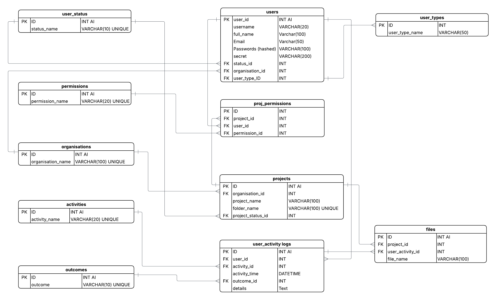

# Secure File Sharing Web Application
Secure file management web application with role-based access control, 2FA authentication, file upload/download to an organisational server, activity logging, and an administrative dashboard for user, permission, and audit management.

## Features

- Secure user authentication with password hashing
- Two-factor authentication (2FA) using QR code setup
- Role-based access control (RBAC) for users and administrators
- Secure file upload, storage, and download system
- Malware scanning for uploaded files
- Activity logging for all user actions (uploads, downloads, login attempts)
- Administrative dashboard for managing users and permissions
- User account lifecycle management (create, activate, deactivate, delete)

## System Architecture

The application follows a monolithic Streamlit-based architecture where all components (UI, business logic, and database interactions) are integrated into a single deployed system.

### High-Level Design

- **Presentation Layer (Streamlit UI)**
  - Handles user interaction, including login, 2FA verification, file upload/download, and administrative dashboards.

- **Application Layer (Python Backend Logic)**
  - Implements authentication, authorisation (RBAC), file processing, malware scanning, and logging.
  - Organised into utility modules for modularity and reuse.

- **Data Layer (MySQL Database)**
  - Stores user credentials, roles, permissions, activity logs, and system metadata.

- **File Storage Layer (Server File System)**
  - Uploaded files are stored on the server’s filesystem.
  - Files are organised into project-specific directories for structured access and isolation.

### Data Flow Overview

1. User authenticates via login + 2FA
2. System verifies credentials and assigns session permissions
3. User requests file operations (upload/download)
4. Files are validated, scanned, and stored in project directories on the server
5. All actions are logged in both the MySQL database and the log files
   
## Project Structure

The codebase is organised into modular components to separate concerns between database operations, business logic, user interface, and configuration assets.

```text
secure-file-sharing-webapp/
│
├── db_utils/
│   ├── fetch_utils.py        # Functions for reading/querying data from MySQL
│   ├── insert_utils.py       # Functions for inserting data into database tables
│   └── modify_utils.py       # Functions for updating/modifying database records
│
├── utils/
│   ├── auth_utils.py         # User authentication, 2FA verification, account lock/unlock
│   ├── file_utils.py         # File handling, malware scanning, zipping, storage operations
│   ├── utils.py              # Logging, password hashing, QR code generation, email setup
│   └── user_utils.py         # User activity logging and status management in DB
│
├── views/
│   ├── access_files.py       # File download interface and permissions handling
│   ├── upload_files.py       # File upload interface and validation logic
│   ├── add_org_proj.py       # Admin interface for creating organisations/projects
│   ├── add_user.py           # User creation interface
│   └── manage_users.py       # Admin controls for user lifecycle management
│
├── sql_scripts/
│   └── file_sharing_main.sql # Database schema and migration scripts
│
├── assets/
│   └── credentials_email.txt # Email template for user onboarding and credentials
│
├── app.py                    # Session management and authentication routing
├── main.py                   # Application entry point and view routing
├── requirements.txt          # Python dependencies
```

## Database Design

The system is built on a relational MySQL database designed to support secure file sharing, role-based access control, project-level permissions, and full audit logging.

The schema is normalised and consists of the following core components:

- User management and authentication
- Organisation and project hierarchy
- Role-based permissions system
- Activity and audit logging
- File tracking linked to user actions

### Entity Relationship Diagram



### Schema Overview

**Core Entities:**
- `users` → stores authentication and identity details
- `user_types` → defines roles (e.g., admin, standard user)
- `user_status` → tracks account state (active, locked, etc.)
- `organisations` → top-level grouping of users/projects
- `projects` → scoped workspaces linked to organisations
- `proj_permissions` → many-to-many mapping of users to project access levels
- `files` → tracks uploaded files and their association to projects and actions
- `user_activity_logs` → audit trail of all system actions
- `activities` / `outcomes` → standardised logging taxonomy

## Setup and Installation

This section describes how to run the application in a local development environment.

### Prerequisites
- Python 3.9+
- MySQL Server
- Git

```bash
# clone the repository
git clone https://github.com/your-username/secure-file-sharing-webapp.git
cd secure-file-sharing-webapp

# create and activate virtual environment
python -m venv venv
source venv/bin/activate   # macOS/Linux
venv\Scripts\activate      # Windows

# install dependencies
pip install -r requirements.txt

# Open MySQL and run the schema script
sql_scripts/file_sharing_main.sql

# Create a .env file with necessary credentials. Refer to utils/utils.py. Then run the application
streamlit run app.py

# Access the application in your browser at
http://localhost:8501
```

## Usage Guide

The system supports two primary user roles: standard users and administrators. Access and available actions depend on assigned permissions.

### User Workflow

1. Log in using username and password
2. Complete two-factor authentication (2FA)
3. Access project-specific dashboards based on permissions
4. Perform allowed actions:
   - Upload files to assigned projects
   - Download files from permitted directories
5. All actions are automatically logged for audit purposes

### Administrator Workflow

Administrators have elevated privileges to manage system users and access control.

Key capabilities include:
- Creating and managing user accounts
- Assigning roles and permissions to users
- Activating, deactivating, or deleting accounts
- Creating organisations and projects
- Viewing system-wide activity logs via the dashboard

### Access Control Summary

- Access is strictly enforced at the project and permission level
- Users only see resources tied to their assigned projects
- Administrative actions are fully tracked in audit logs

## Future Improvements

The current system provides a functional and secure foundation for file sharing and access control. Potential enhancements include:

- Implementation of API layer (FastAPI) to decouple backend logic from the Streamlit frontend
- Real-time notifications for user activities and admin actions
- Improved audit dashboard with filtering, analytics, and export capabilities
- Containerization using Docker for easier deployment and environment consistency
